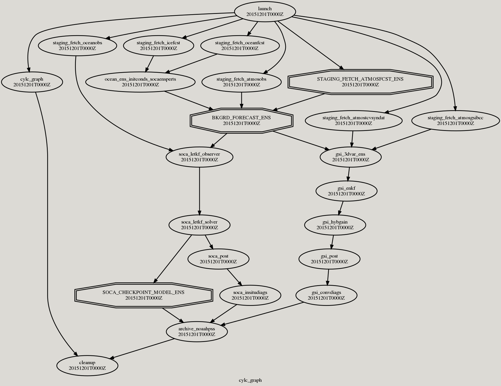
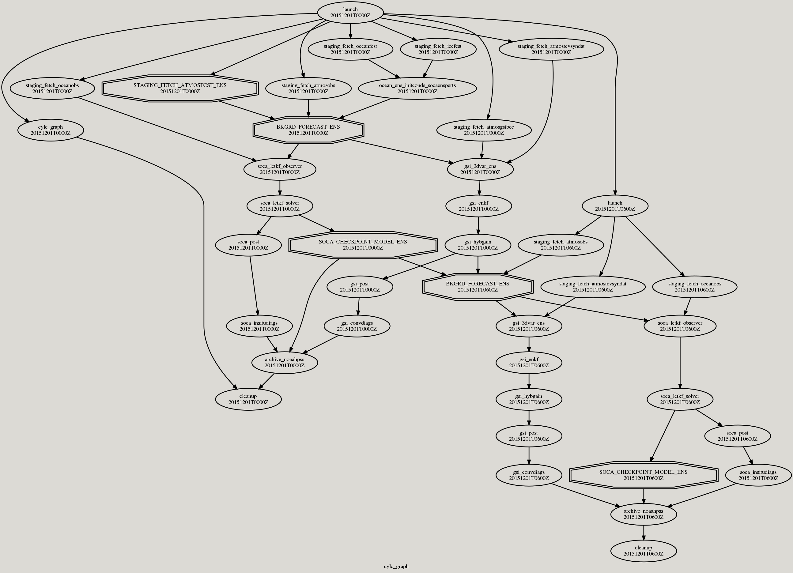
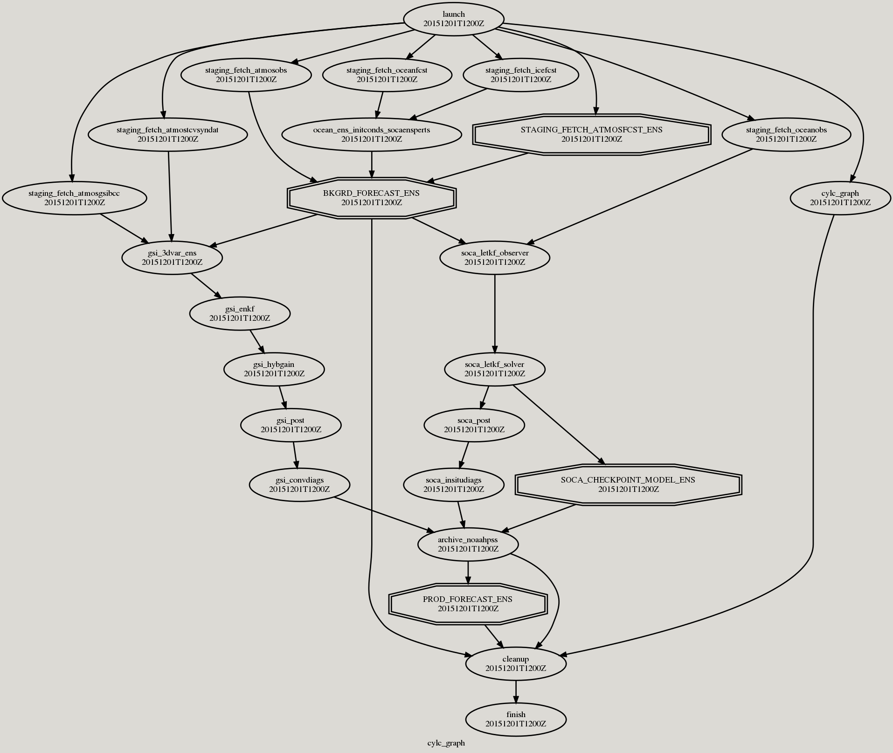

# small-letkf

A quick test run to make sure the gears are turning

- 2 ensemble members
- 30 hour simulation (6 DA cycles)

testing the following added tasks

- `PRODBKGRD_FORECAST_ENS`: after the forecasting is done, the standard workflow
  will copy files to `com/` and `intercom/` directories. This task will
  additionally copy files over to a `products/` directory.
    * Note: Right now this is inside of the `BKGRD_FORECAST_ENS` task, and I
      need to split it out so that the default is returned.
    * See `ush/ufs_rnr/forecast`: `ProdBkgrdForecast` is a class that does the
      main work. It is minimal, only adding on the extra work of looking for the
      `bkgrd_fcst_products.yaml` file (as in this repo/experiment directory),
      and looks for the `products` section of the yaml file, using that to move
      files from the work forecast directory to a place where they can easily be
      manipulated by the `xarray_diagnostics` task (next)

- `xarray_diagnostics`: Take model output from the `products/` directory, and
  write out model prognostic and diagnostic quantities
  nicely, using xarray and zarr. Also compute mean and standard deviation.
    * `ush/ufs_rnr/xarray_diagnostics.py`: note that this module, and the
      classes inside, can only be imported inside of an environment with
      `xarray` and `zarr`. The container I've created for this:
        - can be downloaded from online
          [here](https://cloud.sylabs.io/library/timothyas/ufsrnr/xarray_diagnostics)
        - or can be found on hera at
          `/scratch2/RDARCH/rda-ddm/Tim.Smith/UFS-RNR/exec/ufsrnr_xarray_diagnostics.sif`
    * `scripts/exrnr_xarray_diagnostics.py`: Note that this is not the typical
      way containers are run. Usually these scripts are super minimal, whereas
      here I'm just launching the container from this script. Seemed reasonable
      to me...
    * `jobs/JRNR_XARRAY_DIAGNOSTICS`

- `zarrchive_noaahpss`: tar and copy the zarr stores to NOAA's HPSS. See inside
  of `UFS-RNR`:
    * `ush/ufs_rnr/archive_noaahpss.py`: `ZarrchiveNOAAHPSS` is a new class that
      does the work for this task
    * `scripts/exrnr_zarrchive_noaahpss.py` and `jobs/JRNR_ZARRCHIVE_NOAAHPSS`

- `cleanup`:  In addition to cleaning out the `com` and `intercom` directories
  on `scratch` (after they've been tar'd and sent to HPSS), clean out the
  `products/` directory from scratch space (also after it's been tar'd and sent
  to HPSS)
    * Note: as with the bkgrd forecast task, this one should maybe be split up from
      it's default... but now it's just in the default `cleanup` task
    * `ush/ufs_rnr/cleanup.py`: additionally look for `products/` directory in a
      very convoluted way, only cleaning up directories after we've gotten a
      certain number of cycles away (e.g., only cleanup a cycle's info after we're 2
      cycles in the future, or something)
    * `scripts/exrnr_cleanup.py` and `jobs/JRNR_CLEANUP`


Otherwise the experiment follows [this experimental
setup](https://github.com/NOAA-PSL/UFS-RNR/blob/develop/cylc/experiments/RDHPCS-Hera.LETKF_HYBGAIN.1p0.coupled.yaml)
i.e.,
- Coupled atmosphere, ocean, ice
- 1p0
- LETKF
- RDHPCS-Hera

## Steps

1. Add `rocknroll` environment varialbe to `~/.bashrc`
    ```bash
    export rocknroll=/path/to/this/repo
    ```
   This is used within the yaml files to point to yaml files inside of this
   directory, and one can run `grep rocknroll *.yaml` to find all the
   modifications.

2. Modify `tasks.yaml` to use the right account, e.g. `gsienkf` whereas I'm
   using `rda-ddm`

3. Checkout my fork and branch of UFS-RNR,
   [hero-stuff](https://github.com/timothyas/UFS-RNR/tree/feature/hero-stuff)

4. Copy the file `runtime.UFSRNRv2.ufsp7c.rc` to `UFS-RNR/cylc/runtime/`

5. Copy the `xarray_diagnostics` container over:
    ```bash
    $ cp /scratch2/RDARCH/rda-ddm/Tim.Smith/UFS-RNR/exec/ufsrnr_xarray_diagnostics.sif /path/to/UFS-RNR/exec
    ```

6. Run it
    ```bash
    cd /path/to/UFS-RNR/cylc
    python cylc_run_ufsrnr.py --yaml $rocknroll/experiments/small-letkf/config.yaml
    ```

## The graphs

### Initial



### Cycling



### Final




## Questions

- How many tasks are really necessary for `gsi_3dvar_ens`? One per member? This
  took 20 minutes for a 100 member ensemble but times-out at 45 minutes for 5
  members by using at most 20 tasks per node (and therefore 1 node for this
  small setup). It still took too long with 2 nodes.

